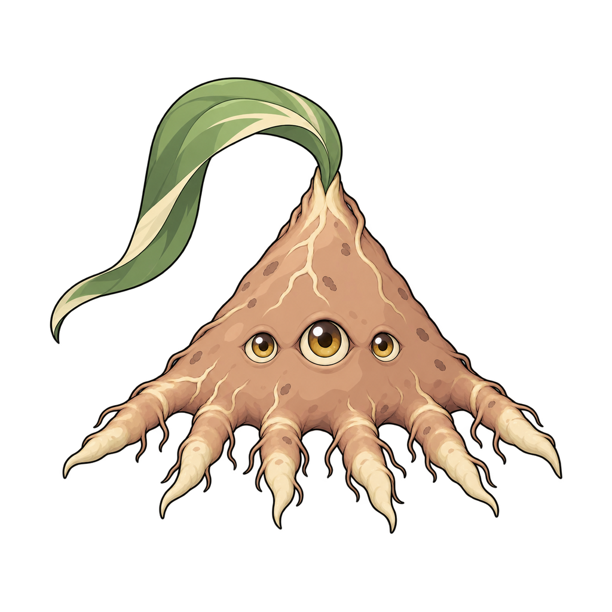
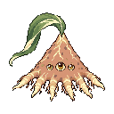
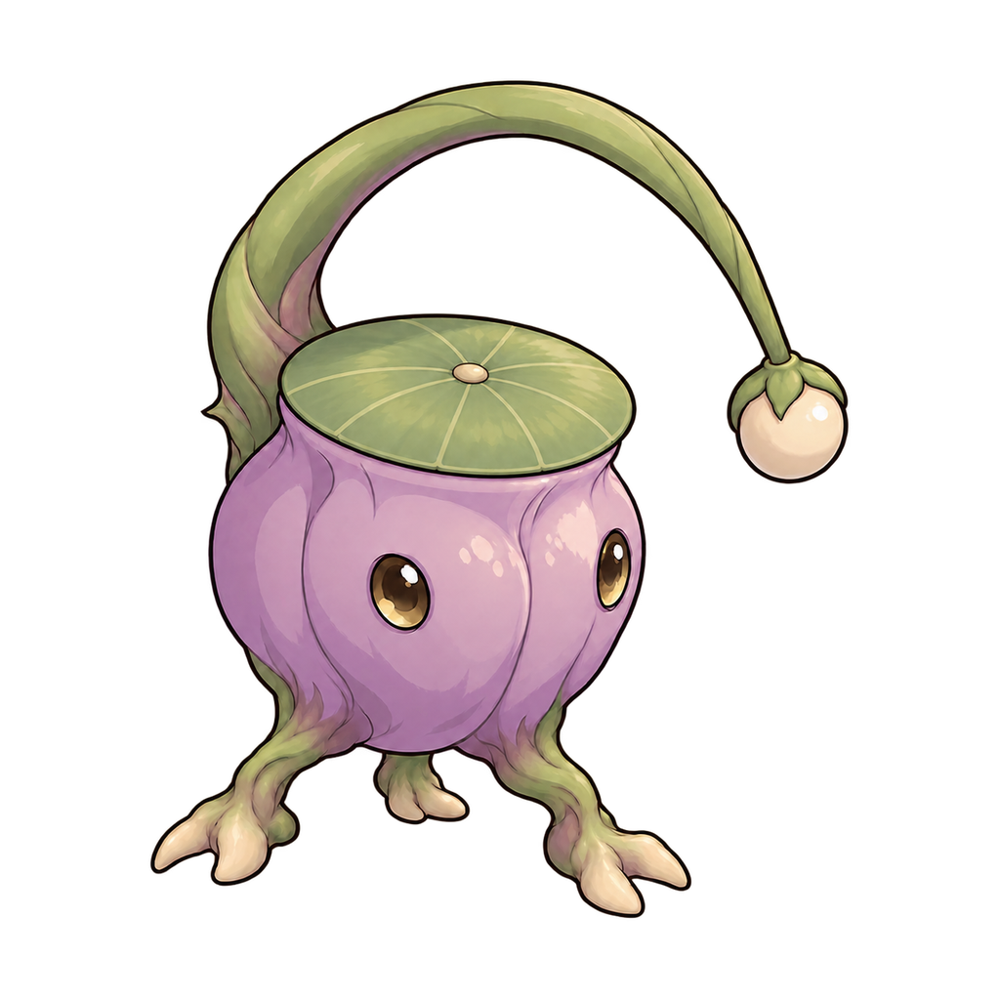
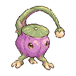
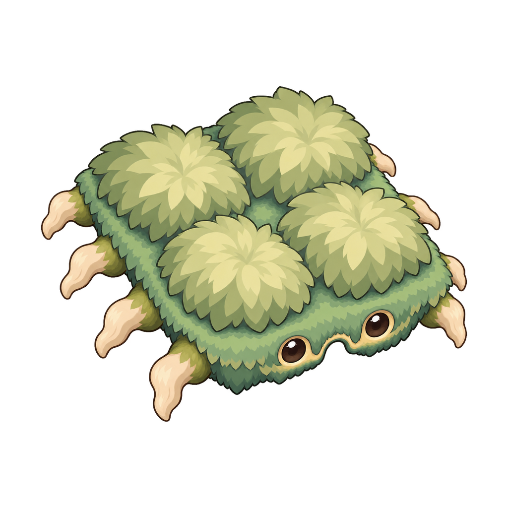
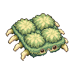
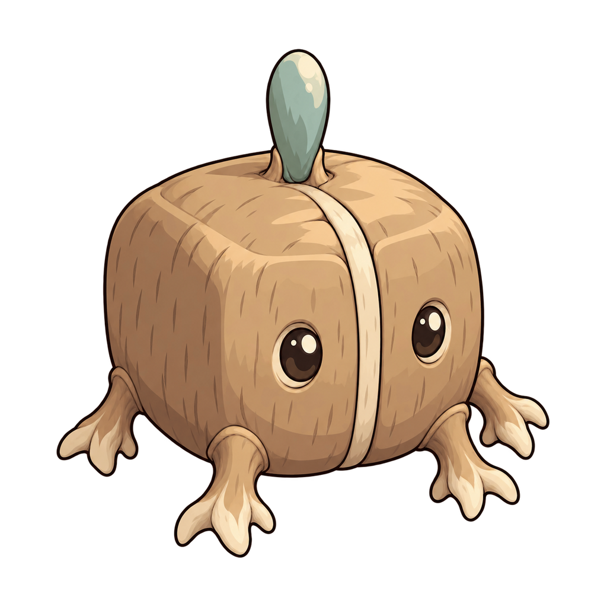
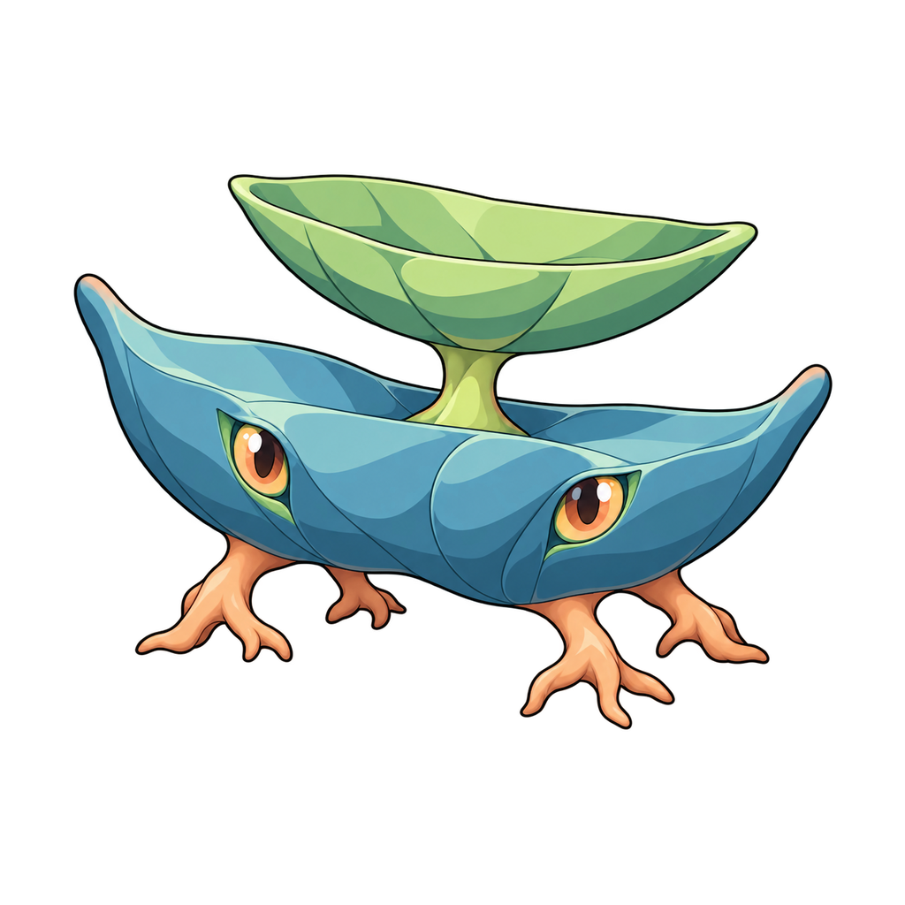
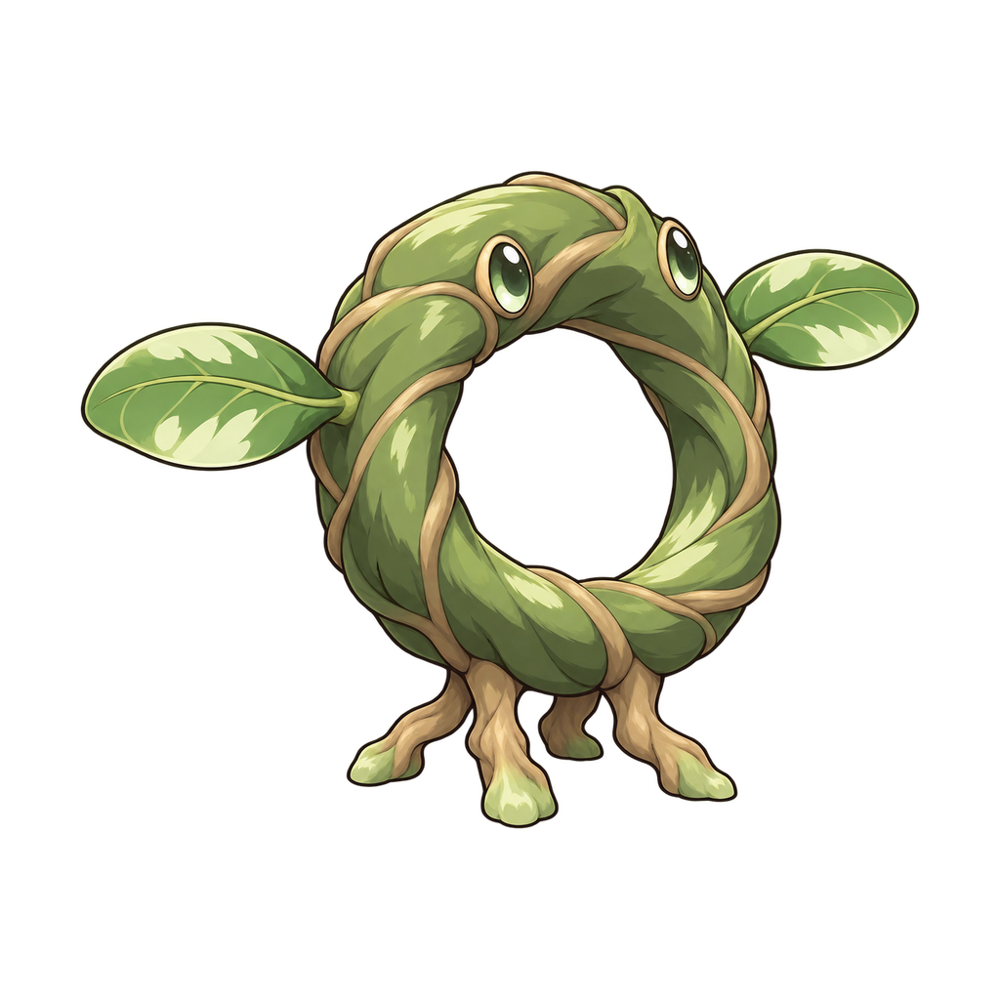
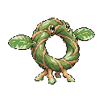

# 追加画像6対の確認一覧

現在6対・12PNGを収録しています。残り47対は同じPRへ順次追加予定です。

生成原本106枚のうち104枚は未復旧です。詳細試行記録も完全には復旧できていません。ここでは完成画像の確認をお願いします。本人による最終受入は未確認です。

[今回の公開用manifest](reviewed-batch-20261009.json)（旧manifestの詳細履歴とは別の追加バッチ記録）

| ID・名称 | 通常 | ドット絵 |
|---|---|---|
| sm-flora-015 ネオオギュ |  |  |
| sm-flora-016 ツリツボネ |  |  |
| sm-flora-017 シキネララ |  |  |
| sm-flora-012 ハコサヤム |  |  |
| sm-flora-014 フタハザラ |  |  |
| sm-flora-008 ツルワモコ |  |  |
